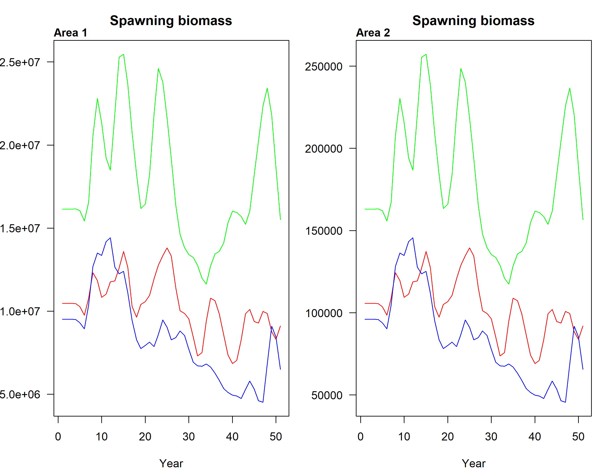
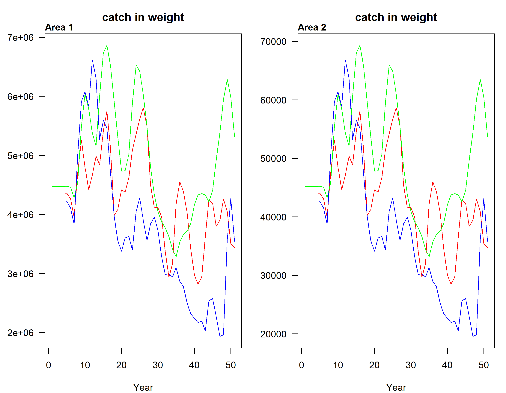
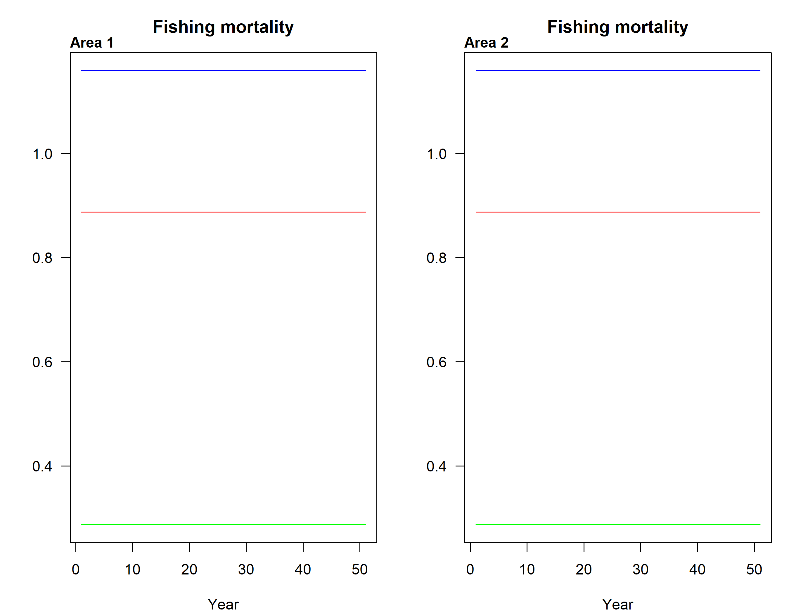
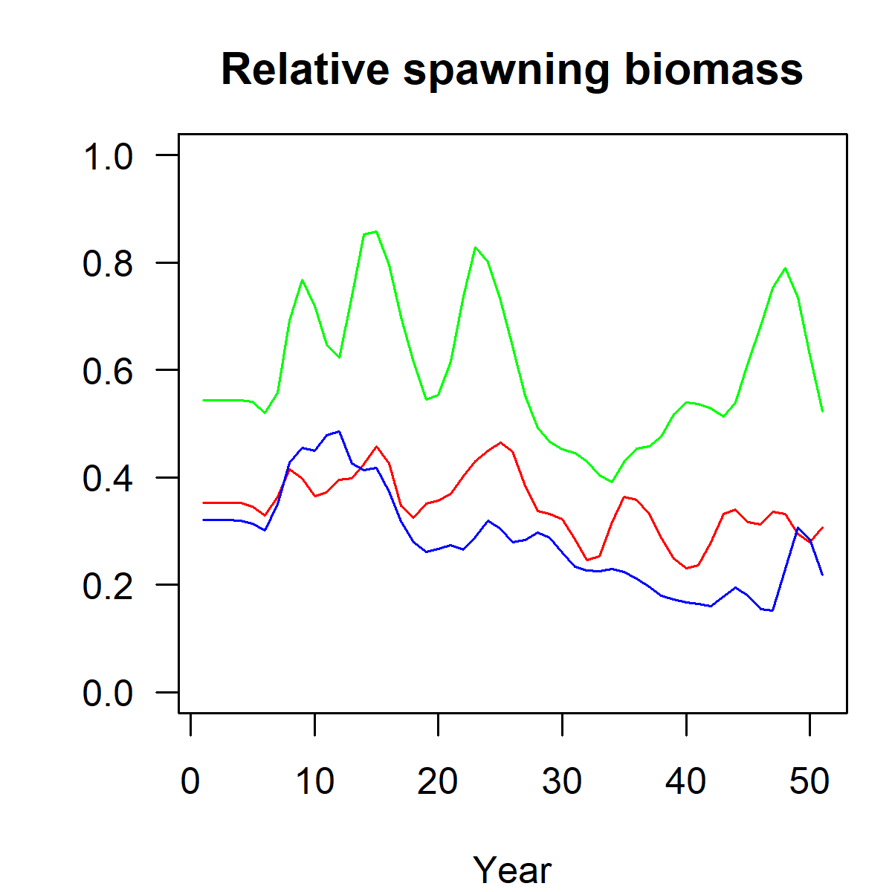

# Operating Model (OM) {#om-pop}

The OM is comprised of three required objects in S4 format:

- Life history object (`LifeHistoryObj`)
- Historical fishery object (`HistFisheryObj`)
- Time-area object (`TimeAreaObj`)

Optional:

- Stochastic object (`StochasticObj`)

Each of these S4 objects contains a specific number of slots, which can be accessed using the `slotNames()` function. These slots are populated within R. The simplest way to start building the OM is to create a new object using the R function `new()` and populate it with the required input information and parameters. The first step, before populating the slots of each object, is to create a new object using the `new()` function.

```{r setup, include=FALSE}
# Load necessary package
library(fishSimGTG)
library(fishSimTools)
```

## Time area object

The `TimeAreaObj` object holds temporal and spatial elements of the operating model, including descriptions of time steps, growth-type groups (GTGs), and spatial area parameters. The **FishSimGTG** package allows the user to model migration between multiple areas. 

To create a new object of class `TimeArea`, use the `new()` function as follows:

```{r, eval=TRUE, echo=TRUE}
TimeAreaObj<-new("TimeArea")
```

To populate the slots of the `TimeAreaObj` object, the user should start by defining a meaningful title (`title`). Similar to the other S4 objects, the slot names of the `TimeAreaObj` can be viewed using the `slotNames()` function, and the user can access the help file using the `?` symbol.

```{r, eval=TRUE, echo=TRUE}
slotNames(TimeAreaObj)
```

```{r, eval=FALSE, echo=TRUE}
#getting help
?`TimeArea-class` 
```

```{r, eval=TRUE, echo=TRUE}
TimeAreaObj@title = "Test"
TimeAreaObj@gtg = 13
TimeAreaObj@areas = 2
TimeAreaObj@recArea = c(0.99, 0.01)
TimeAreaObj@iterations = 100
TimeAreaObj@historicalYears = 10
TimeAreaObj@historicalBio = 0.5
TimeAreaObj@historicalBioType = "relB"
TimeAreaObj@move = matrix(c(1,0, 0,1), nrow=2, ncol=2, byrow=FALSE)
TimeAreaObj@historicalEffort = matrix(1:1, nrow = 10, ncol = 2, byrow = FALSE)
```

The **FishSimGTG** package allows for accounting for individual variation in growth trajectories by dividing the population into growth-type groups (GTGs), so each age class is divided into a collection of smaller cohorts or GTGs. The `gtg` slot in `TimeAreaObj` represents the number of growth-type groups, with a default value of 13.

`areas` represents the number of areas in the model, and it must be greater than 1, even when a single-area model is desired. 

`recArea` is a vector of length `areas`. Each element of the vector represents the fraction of recruitment to each area, with the values summing to 1. In this example, 0.99 of the recruitment is assigned to area 1, and 0.01 to area 2, implying that the model is treated similarly to a single-area model.

`iterations` is the number of iterations to run (i.e., the number of simulations).

`historicalYears` are the number of years to simulate historical dynamics.

`historicalBio` is a value grater than 0 and less than 1. The model assumes the population does not start in unfished conditions.

`historicalBioType`is a string, that represents the type of historical biomass state. The options are: "relB" (relative spawning biomass) or "SPR" (Spawning Potential Ratio).

`move` is a matrix of migration rates of dimensions `areas` x `areas`.

`historicalEffort` is a matrix of nrows = `historicalYears` and ncols = `areas` that contains value multipiers of initial equilibrium fishing mortality. In its current form, **FishSimGTG** is specified such that fishing mortality rate is proportional to fishing effort. Thus, where historical patterns of fishing effort are available, these can be re-scaled as multipliers of the initial equilibrium fishing mortality.  

## Life history object

The `LifeHistoryObj` is an S4 object of the class `LifeHistory` that holds the description of a life history.
To create a new object of class `LifeHistory`, use the `new()` function, as follows:

```{r, eval=TRUE, echo=TRUE}
LifeHistoryObj <- new("LifeHistory")
```

The user can see the elements or slots of the `LifeHistoryObject` using the  `slotNames()` function.

```{r, eval=TRUE, echo=TRUE}
slotNames(LifeHistoryObj)
```

The user can access the help file for classes by using `?` symbol

```{r, eval=FALSE, echo=TRUE}
?`LifeHistory-class`  
```

In the help file, the user will find a description of the `LifeHistoryObject` and the elements or slots it contains. To populate the rest of the slots of the `LifeHistoryObject`, the user should start by defining a useful title (`title`), followed by the scientific name of the species (`speciesName`). If desired, the user can add a short description (`shortDescription`) of the object.

```{r, eval=TRUE, echo=TRUE}
LifeHistoryObj@title<-"Kole"
LifeHistoryObj@speciesName<-"Ctenochaetus strigosus"
LifeHistoryObj@shortDescription<-"stock name/location"
```

Then, the user can proceed to populate the rest of the slots as follows:

```{r, eval=TRUE, echo=TRUE}
LifeHistoryObj@Linf<-17.7
LifeHistoryObj@K<-0.423
LifeHistoryObj@t0<- -0.51
LifeHistoryObj@L50<-8.4
LifeHistoryObj@L95delta<-1.26
LifeHistoryObj@M<-0.08
LifeHistoryObj@L_type<-"FL"
LifeHistoryObj@L_units<-"cm"
LifeHistoryObj@LW_A<-0.046
LifeHistoryObj@LW_B<-2.85
LifeHistoryObj@Steep<-0.54
LifeHistoryObj@recSD<-0
LifeHistoryObj@recRho<-0
LifeHistoryObj@isHermaph<-FALSE
LifeHistoryObj@R0<-10000
```

Growth is modeled in the **FishSimGTG** package using a von Bertalanffy growth curve, where `Linf` represents the asymptotic length, `K` the Brody growth rate coefficient (with units in yr\(^{-1}\)), and `t0` represents the time or age when the average length was zero.

Maturity parameters are represented by the `L50` and `L95delta` parameters, assuming that maturity is size-dependent and follows a logistic model. The `L50` is the length at 50% maturity, and the `L95delta` is the length increment between L50 and the length at 95% maturity. `L95delta` must be a value larger than 0.

`M`, represent the natural mortality rate per year. 

`L_type` represents the method of measuring length. e.g. `"TL"` for total length or `"FL"` for fork length. Must be consistent for all length parameters (e.g., `Linf`, `L50`, `L95delta`). `L_units`, are the units of measure (`"cm"` is expected). `L_units` must be consistent for all length parameters (e.g., `Linf`, `L50`, `L95delta`).

`LW_A` and `LW_B` are the parameters of the allometric length-weight relationship. `Walpha_units` (**help file-W_units**)represents the measurement units of weight and must be consistent with the `LW_A` and `LW_B` parameters.

Recruitment is modeled using a Beverton-Holt stock-recruitment relationship, parameterized in terms of steepness (`Steep`). Values for `Steep` range between >0.2 to 1. `R0` represents the initial number of unfished recruits (positive number). Recruitment process error is generated from a normal distribution with mean zero and standard deviation represented by `recSD`. Autocorrelation in recruitment deviations in log space are defined by `recRho`, producing 1-year lagged correlation. `recSD` and `recRho`, are non-negative real numbers.

The **FishSimGTG** package allows for modeling the population dynamics of gonochoristic and protogynous hermaphroditic species. The user will set `isHermaph` to `TRUE` when the species is a protogynous hermaphrodite and to `FALSE` when it is a gonochoristic species. If the species is a protogynous hermaphrodite, the user will need to define two additional parameters: `H50` and `H95delta`. `H50` represents the length at which 50% of the population are male, and `H95delta` represents the length increment between `H50` and length at which 95% of the population are male. `H95delta` must be a value larger than 0. 

`MK` and `Tmax` are optional parameters. `MK` represents the M/K ratio (natural mortality divided by von Bertalanffy K coefficient) and is not utilized by **FishSimGTG**; however, sister R packages such as **fishLengthAssess** can utilize this parameter as part of length-based stock assessment. To utilize functionality within **FishSimGTG**, `M` and `K` should be specified in separate slots. `Tmax` is the maximum observed age that defines the plus-group in modeling population dynamics. When `Tmax` is not specified (the default), the age to which 1% the population survives in an unfished system is used to calculate `Tmax`. When `Tmax` is specified, it must take on a quantity equal to or greater than 2.


The **FishSimGTG** package includes several plotting functions that allow users to explore the simulated life history before proceeding to analysis. The life history schedules can be plotted using the `LHwrapper()` function. This function displays the plot in the console and also returns all the details of the life history. The user can access the help file for the `LHwrapper()` function by using the `?` symbol (`?LHwrapper`).

```{r lifehist, eval=TRUE, echo=TRUE, fig.cap= "Life history schedules.", fig.show="hold", out.width="100%"}
#To simply display to the console
lhOut<-LHwrapper(LifeHistoryObj, TimeAreaObj, doPlot = TRUE)
```

The upper panels represent the von Bertalanffy growth curve (left) and the maturity ogive (right). The bottom panels represent the weight-at-age relationship and the allometric length-weight relationship.

`lhOut` returns all the details of the life history.

```{r, eval=FALSE, echo=TRUE}
#To return life history details
lhOut
```

```{r, eval=TRUE, echo=FALSE}
#To simply display to the console
lhOut<-LHwrapper(LifeHistoryObj, TimeAreaObj, doPlot = FALSE)
```

## Historical fishery object

The `HistFisheryObj` is an S4 object of the class `Fishery` that holds fishery characteristics, including vulnerability, retention, and discard information. In its current configuration, the characteristics defined in the `HistFisheryObj` apply to all areas. Doing so enables rapid calculation of initial stable age distribution within each area. This structure should be interpreted as the state of the resource prior to any spatial management, or alternatively, as homogeneous fishery characteristics across all areas.


To create a new object of class `Fishery`, use the `new()` function, as follows:

```{r, eval=TRUE, echo=TRUE}
HistFisheryObj<-new("Fishery")
```

The slot names of the `HistFisheryObj` can be seen using the `slotNames()` function.

```{r, eval=TRUE, echo=TRUE}
slotNames(HistFisheryObj)
```

The user can access the help file using `?` symbol

```{r, eval=FALSE, echo=TRUE}
?`Fishery-class`  
```

In the help file, the user will find a description of the `HistFisheryObj` and the elements or slots it contains. To populate the slots, the user should start by defining a meaningful title (`title`), followed by specifying the selectivity/vulnerability, retention, and discard information.


```{r, eval=TRUE, echo=TRUE}
HistFisheryObj@title<-"Test"
HistFisheryObj@vulType<-"logistic"
HistFisheryObj@vulParams<-c(10.2,0.1) #Approx. knife edge
HistFisheryObj@retType<-"full"
HistFisheryObj@retMax <- 1
HistFisheryObj@Dmort <- 0
```

### Selectivity

Selectivity or vulnerability is the probability of being selected or becoming vulnerable to the fishing gear. In the **FishSimGTG package**, selectivity is defined with respect to length, with a maximum value of 1 enforced.
`vulType` describes the type of selectivity/vulnerability function for the historical time period. The user can see a detailed description of the different selectivity functions by exploring the `?selWrapper` function.

Common vulnerability types: 

- "**logistic**" selectivity with two parameters (`vulParams`) represented by the length at 50% of selectivity and the length increment between the length at 50% of selectivity and the length at 95% selectivity.

- "**explog**" is an exponential logistic selectivity (dome-shaped) function, defined by three parameters (`vulParams`), represented as `c(p1, peak, and p3)`. To use the "**explog**" function, the user must first provide the ascending rate (p1), which should be within the range of 0.02 to 1. Next, the user needs to define the peak of the vulnerability function, which corresponds to the location of the peak of the dome-shaped selectivity curve or the length at which selectivity is highest. 

- As an aside, this peak is used to calculate p2, which determines the position of the peak relative to the range of lengths. For example, if the length range is between 1 and 20 cm, and p2 is set to 0.5, the peak will be at 10 cm. Given p2, the peak can be calculated using the following equation:

\[
\text{peak} = \text{min}(\text{Length}) + p_2 \times (\text{max}(\text{Length}) - \text{min}(\text{Length}))
\]

- p2 must be within the range of 0.01 to 0.9, with a reasonable starting value of 0.5. By adjusting p2, the user can shift the peak along the length range, from the minimum length to the maximum length.

- Finally, the user must provide p3, which is the descending rate, and which must be within the range of 0.001 to 0.5. A value of 0.001 provides a nearly asymptotic curve, while values above 0.2 produce a strongly dome-shaped function, where the p3 and p1 parameters interact strongly.

### Retention

Retention is the probability of being retained (kept by the fleet) and not discarded. It describes both the shape with respect to length and the maximum value, which can be less than 1. Fish that are selected by the fishing gear but not retained are discarded (discard mortality rate). The probability of being landed (**keep**), is calculated as Vulnerability × Retention. The user can see a detailed description of the different retention types by exploring the `?selWrapper` function.

There are three retention types (`retType`):

- "**full**" retention assumes that keep is equal to retention. There are no parameters (`retParams`) for "full" retention.

- "**logistic**" retention has two parameters (`retParams`): the length at 50% retention and the length increment to 95% retention.

- "**slotLimit**" retention includes two parameters (`retParams`): minimum length and maximum length, where catches occur between the minimum and maximum values.

`retMax` is a numeric value between 0 and 1 that defines the peak of the retention curve.

### Discard mortality rate

Discard mortality rate represents the fish that are selected but not retained, and are therefore subject to the discard mortality rate (`Dmort`). `Dmort` is the fraction of discards that are killed (e.g., 0.25 means 25% are killed). This value must be between 0 and 1.

<!-- **Dead discards** are the deaths resulting from vulnerable abundance that is not retained, defined as: -->

<!-- \[ \text{Dead discards} = \text{Vul} \times (1 - \text{Ret}) \times \text{Dmort} \] -->

<!-- where `Dmort` is the discard mortality rate. -->

<!-- **Total dead** is the probability of removal from the population via landing or discard, calculated as: -->

<!-- \[ \text{Total dead} = \text{Vul} \times (\text{Ret} + (1 - \text{Ret}) \times \text{Dmort}) \] -->

### Fishery plots

The **FishSimGTG** package includes several plotting functions that allow users to explore the simulated Vulnerability, retention, keep, dead discards, and removals at length. Fishery characteristics can be plotted using the `selWrapper()` function. This function displays the plot in the console. The user can access the help file for the `selWrapper()` function by using the `?` symbol (`?selWrapper`).

```{r sel, eval=TRUE, echo=TRUE, fig.cap= "Logistic selectivity function.", fig.show="hold", out.width="100%"}
selOut<-selWrapper(lh = lhOut, TimeAreaObj, FisheryObj = HistFisheryObj, doPlot = TRUE)
```

`selOut` returns all the details of the fishery selectivity.

```{r, eval=FALSE, echo=TRUE}
#To return sel details
selOut
```

If the user modifies the vulnerability, retention, and discard parameters in the `HistFisheryObj`, other selectivity/vulnerability and retention shapes can be explored. For example:

-- Assuming a vulnerability type `vulType` of "explog", with parameters p1, peak, and p3.

```{r sel2, eval=TRUE, echo=TRUE, fig.cap= "Exponential logistic selectivity (dome-shaped).", fig.show="hold", out.width="100%"}
HistFisheryObj@vulType<-"explog"
HistFisheryObj@vulParams<-c(0.9,10,0.15) #dome-shaped
HistFisheryObj@retType<-"full"
HistFisheryObj@retMax <- 1
HistFisheryObj@Dmort <- 0
selOut<-selWrapper(lh = lhOut, TimeAreaObj, FisheryObj = HistFisheryObj, doPlot = TRUE)
```

-- Assuming a vulnerability type `vulType` of "logistic", with changes in the retention type (`retType`) and retention parameters (`retParams`).

```{r sel3, eval=TRUE, echo=TRUE, fig.cap= "Logistic selectivity function with different retention parameters.", fig.show="hold", out.width="100%"}
HistFisheryObj@vulType<-"logistic"
HistFisheryObj@vulParams<-c(10.2,0.1) #Approx. knife edge
HistFisheryObj@retType<-"logistic"
HistFisheryObj@retParams<-c(11,0.8)
HistFisheryObj@retMax <- 1
HistFisheryObj@Dmort <- 0
selOut<-selWrapper(lh = lhOut, TimeAreaObj, FisheryObj = HistFisheryObj, doPlot = TRUE)
```

## Stochastic object

The `StochasticObj` is used as a catch-all object for specifying magnitude of variation in input parameters, in two ways. Its first usage, and technically poor use of the term 'stochastic', is to represent a modeling approach that accounts for uncertainty in various input parameters (e.g., initial depletion, life history, selectivity, and annual recruitment deviations). Its second usage is to represent inter-annual variation (not yet implemented, except for recruitment deviations that are specified within a `LifeHistoryObject`).   

The `StochasticObj` holds the parameters for characterizing uncertainty about population and fishery dynamics.
To create a new object of class `Stochastic`, use the `new()` function.

```{r, eval=TRUE, echo=TRUE}
StochasticObj<-new("Stochastic")
```

Similar to other S4 objects, the slot names of `StochasticObj` can be viewed using the `slotNames()` function, and the help file can be accessed using the `?` symbol. 

```{r, eval=TRUE, echo=TRUE}
slotNames(StochasticObj)
```

```{r, eval=FALSE, echo=TRUE}
#getting help
?`Stochastic-class`  
```

To populate the slots of `StochasticObj`, the user should begin by defining a meaningful title (`title`) and specifying the parameters in which they want to include variation.

The slots defined in the `StochasticObj` object create additional inputs and override parameters specified elsewhere (e.g., `LifeHistoryObj`, `HistFisheryObj`, or `TimeAreaObj`), allowing the corresponding model components to become random processes. Values for these components are generated ahead of simulation and retained to ensure reproducibility of results.

In the following example, we add uncertainty to `historicalBio`. As state of depletion can be uncertain, initial depletion can be implemented as a range of plausible values, producing slightly different values for each iteration. This is achieved by assigning a vector of length 2 that contains the lower and upper bounds of a uniform distribution to the slot `StochasticObj@historicalBio`. Doing so will override (replace) the quantity defined in the `TimeAreaObj` object (`TimeArea@historicalBio`). For each iteration, one value is drawn from a uniform distribution. Importantly, `TimeArea@historicalBioType` continues to determine the type of historical biomass state (e.g., 'relB' or 'SPR').

```{r, eval=TRUE, echo=TRUE}
StochasticObj@title<-"adding unceratinty"
StochasticObj@historicalBio = c(0.3, 0.6)
```

### Uncertainty in life history

All scalar parameters in the `LifeHistoryObj` object that hold a single value, such as `Linf`, `K`, `L50`, `L95delta`, `M`, `Steep`, `recSD`, `recRho`, `H50`, and `H95delta`, can be redefined in the `StochasticObj` object. When redefined, they are replaced by a vector of length 2 containing the minimum and maximum values. If provided, these values override those in the `LifeHistoryObj`, and a unique value for each iteration is generated by sampling from the uniform distribution.

```{r, eval=FALSE, echo=TRUE}
StochasticObj@Steep = c(0.5, 0.6) #e.g., adding stochasticity to Steepness
```

### Uncertainty in the historical fishery

A matrix with \(n\) columns and 2 rows is used to define the range of uncertainty for the vulnerability (`vulParams`) and retention (`retParams`) parameters from the `HistFisheryObj` in the `StochasticObj` object. Row 1 contains the minimum values, and row 2 contains the maximum values for each parameter, corresponding to the respective column \(n\).

When this matrix is provided in the `StochasticObj` object, it replaces the `vulParams` and `retParams` slots previously defined in the `HistFisheryObj`. This ensures that the columns of the matrix align with the required inputs for `vulType` and `retType` in the `HistFisheryObj` object.

The same logic applies to redefining the `Dmort` parameter, but in this case, the matrix contains only 1 column and 2 rows (min and max), as the `Dmort` parameter is a scalar. When this matrix is provided, it replaces the `Dmort` slot in the `HistFisheryObj`.

```{r, eval=FALSE, echo=TRUE}
#just to continue with the original configuration of sel and retention
HistFisheryObj@vulType<-"logistic"
HistFisheryObj@vulParams<-c(10.2,0.1) #Approx. knife edge
HistFisheryObj@retType<-"full"
HistFisheryObj@retMax <- 1
HistFisheryObj@Dmort <- 0

StochasticObj@histFisheryVul=matrix(c(9,11,0.07,0.13), nrow=2, ncol=2,byrow=FALSE)  #e.g., adding stochasticity to histFisheryVul
```

There are additional slots in the `StochasticObj` object that modify fishery projections (`ProFisheryObj`), which will be described in detail in a separate section.

## Initial conditions

&nbsp;&nbsp;&nbsp;&nbsp;This modeling framework was developed to create historical dynamics of fish stocks that begin (i.e., year 0) in a fished state, meaning that fishing mortality (and consequently fishing effort) are greater than zero in the initial equilibrium year (year 0). Thus, the modeling framework is not suitable for circumstances for initializing the model in an unfished or pre-fishing state. Accordingly, initial depletion (spawning biomass relative to unfished spawning biomass) should always be less than 1.0.  An alternative formulation is available where initial ‘depletion’ can instead be specified as initial Spawning Potential Ratio (SPR). SPR is spawning biomass per recruit relative to unfished spawning biomass per recruit). Subsequently, the population is initialized as follows. First, equilibrium age-structure is determined for the given depletion or SPR level assuming area-specific recruitment fractions, \(\rho_i\), but no movement, resulting in an equilibrium fishing mortality rate and equilibrium abundance scaled relative to the specified \(R_0\). Second, a burn-in period is used to project the population forward for \(A\)x4 years at the estimated equilibrium fishing mortality rate, allowing a stable age distribution between areas to be obtained through migration.

## Historical dynamics

This example illustrates specification of an operating model (OM) and simulation of historical dynamics.

```{r, eval=TRUE, echo=TRUE}
# Load necessary package
library(fishSimGTG)
library(fishSimTools)
library(here)
```

### Populate the life history object

```{r, eval=TRUE, echo=TRUE}

LifeHistoryObj <- new("LifeHistory")
LifeHistoryObj@title<-"Hawaiian Uhu - Parrotfish"
LifeHistoryObj@speciesName<-"Chlorurus perspicillatus"
LifeHistoryObj@Linf<-53.2
LifeHistoryObj@K<-0.225
LifeHistoryObj@t0<- -1.48
LifeHistoryObj@L50<-35
LifeHistoryObj@L95delta<-5
LifeHistoryObj@M<-0.16
LifeHistoryObj@L_type<-"FL"
LifeHistoryObj@L_units<-"cm"
LifeHistoryObj@LW_A<-0.0136
LifeHistoryObj@LW_B<-3.109
LifeHistoryObj@Steep<-0.6
LifeHistoryObj@isHermaph<-TRUE
LifeHistoryObj@H50<-46.2
LifeHistoryObj@H95delta<-11.8
LifeHistoryObj@recSD<-0.6
LifeHistoryObj@recRho<-0
LifeHistoryObj@R0<-10000
```

### Populate the historical fishery object

```{r, eval=TRUE, echo=TRUE}

HistFisheryObj<-new("Fishery")
HistFisheryObj@title<-"Test"
HistFisheryObj@vulType<-"logistic"
HistFisheryObj@vulParams<-c(40, 1)
HistFisheryObj@retType<-"full"
HistFisheryObj@retMax <- 1
HistFisheryObj@Dmort <- 0
```

### Populate the time-area object

```{r, eval=TRUE, echo=TRUE}

#This setup will be used to produce a single-stock with no movement.
#fishSimGTG requires specifying a minimum of two areas. 
#However, we will treat those areas as a homogeneous fish stock by applying the same F to each area (see TimeAreaObj@historicalEffort)

TimeAreaObj<-new("TimeArea")
TimeAreaObj@title = "Example"
TimeAreaObj@gtg = 13
TimeAreaObj@areas = 2
TimeAreaObj@recArea = c(0.99, 0.01)
TimeAreaObj@iterations = 3
TimeAreaObj@historicalYears = 50
TimeAreaObj@historicalBio = 0.5
TimeAreaObj@historicalBioType = "relB"
TimeAreaObj@move <- matrix(c(1,0, 0,1), nrow=2, ncol=2, byrow=FALSE)
TimeAreaObj@historicalEffort<-matrix(1:1, nrow = 50, ncol = 2, byrow = FALSE)

```

### Review life history characteristics

The function `LHwrapper` can be used to verify the paramaterization of the `LifeHistoryObj` object. Set `doPlot` to `TRUE` to produce a plot of life history characteristics. 

```{r lhgrouper, eval=TRUE, echo=TRUE, fig.cap= "Life history summary."}
#To simply display to the console
lhOut<-LHwrapper(LifeHistoryObj, TimeAreaObj, doPlot = TRUE)
```

```{r, eval=FALSE, echo=TRUE}
#To return life history details
lhOut
```

### Review fishery characteristics

The function `selWrapper` can be used to verify the paramaterization of the `FisheryObj` object. Set `doPlot` to `TRUE` to produce a plot of fishery characteristics. 

```{r selgrouper, eval=TRUE, echo=TRUE, fig.cap= "Fishery summary."}
selOut<-selWrapper(lh = lhOut, TimeAreaObj, FisheryObj = HistFisheryObj, doPlot = TRUE)
```

```{r, eval=FALSE, echo=TRUE}
#To return fishery details
selOut
```

### Populate optional key uncertainties

```{r, eval=TRUE, echo=TRUE}
#Populate the optional Stochastic object. 
#Here, initial biomass range is set. A value for each iteration is drawn from a uniform distribution
StochasticObj<-new("Stochastic")
StochasticObj@historicalBio = c(0.3, 0.6)
``` 

### Generate historical dynamics 

With the following objects specified, historical dynamics are simulated using the function `runProjection` (See Section \@ref(mse)).

- Life history object (`LifeHistoryObj`)
- Historical fishery object (`HistFisheryObj`)
- Time-area object (`TimeAreaObj`)
- (optional) Stochastic object (`StochasticObj`)

Notice that only historical dynamics are simulated when MP objects `StrategyObj` and `ProFisheryObj_list` are omitted from `runProjection`. Below, the diagnostic plots produced by `runProjection` illustrate patterns in the historical dynamics.

```{r, eval=TRUE, echo=TRUE}
#To return life history details
runProjection(LifeHistoryObj = LifeHistoryObj,
              TimeAreaObj = TimeAreaObj,
              HistFisheryObj = HistFisheryObj,
              StochasticObj = StochasticObj,
              wd = here('data-test', 'Historical'),
              fileName = "HistoricalDy",
              doPlot = TRUE,
              titleStrategy = "HistoricalDy"
)
```

```{r, fig.cap="Spawning biomass by area", echo=FALSE}

```

```{r, fig.cap="Catch biomass by area", echo=FALSE, out.height="50%"}

```

```{r, fig.cap="Fishing mortality by area- Higher_option2", echo=FALSE, out.width="100%"}

```

```{r, fig.cap="Relative spawning stock biomass, in aggregate across areas", echo=FALSE, out.width="100%"}

```

