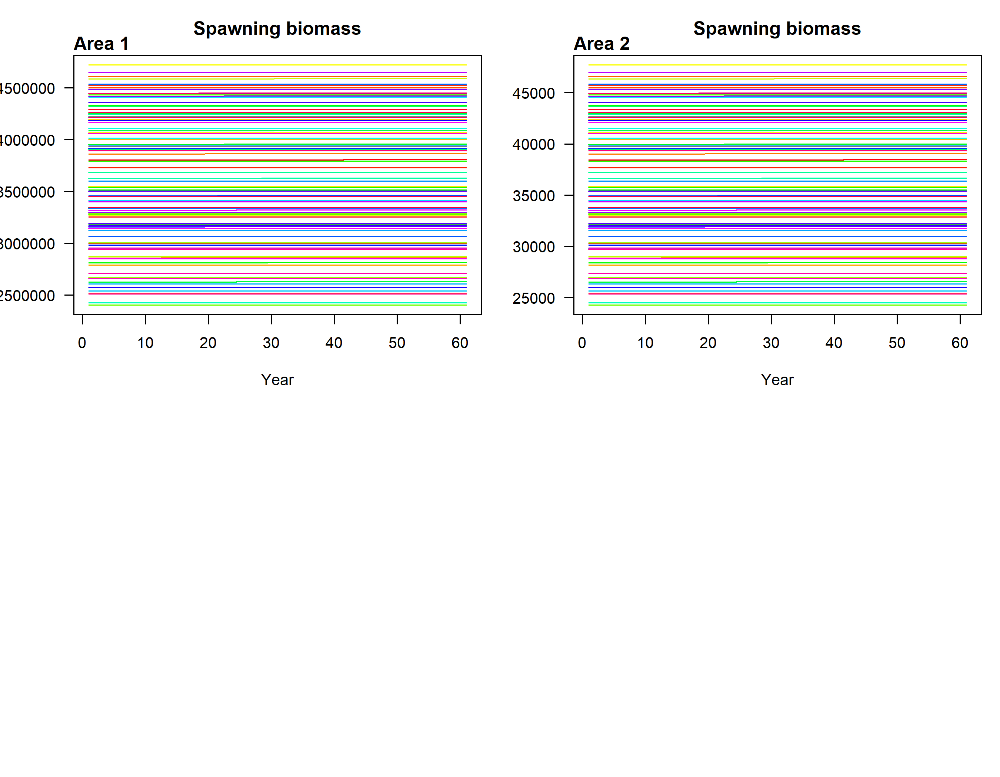
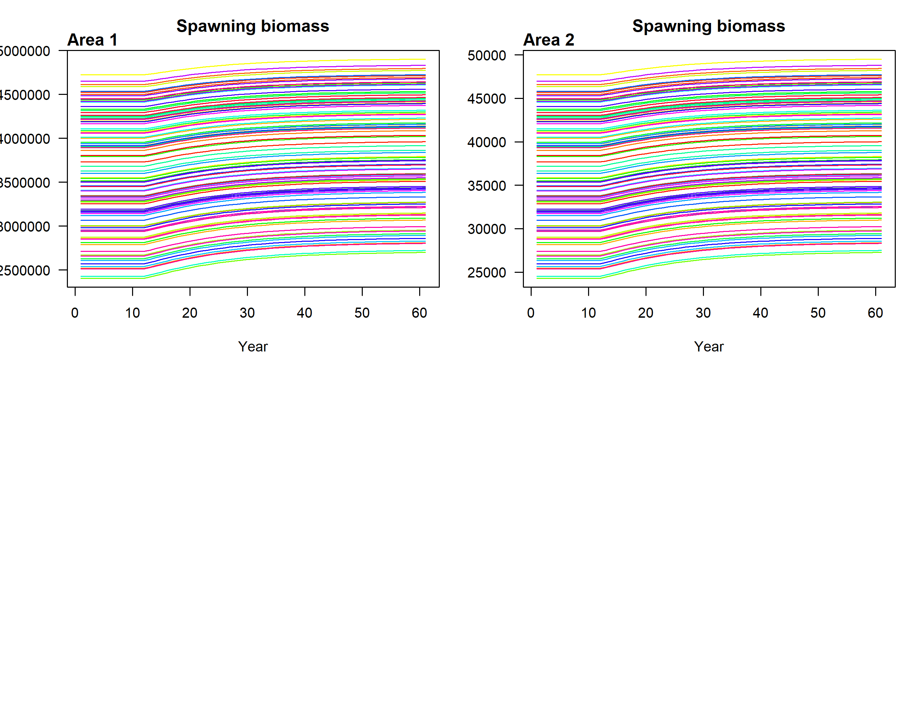
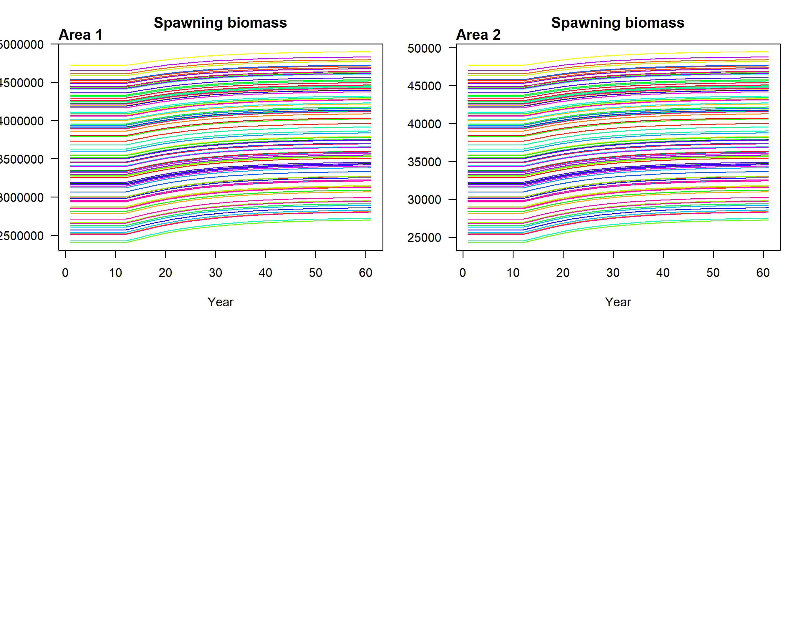
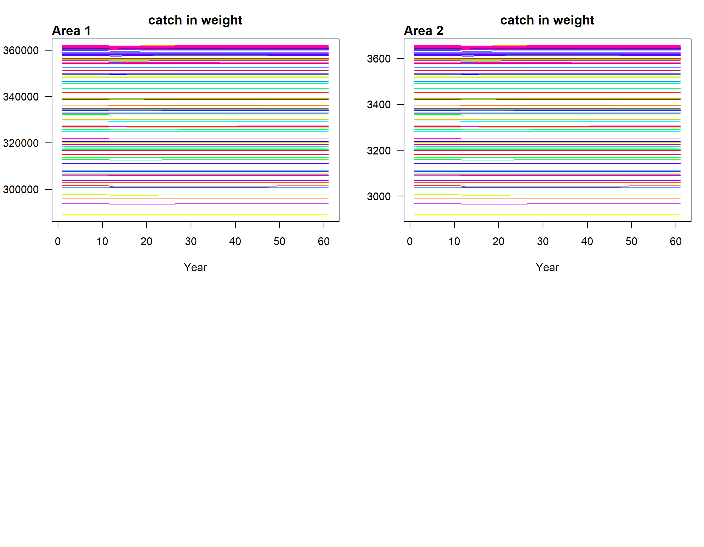
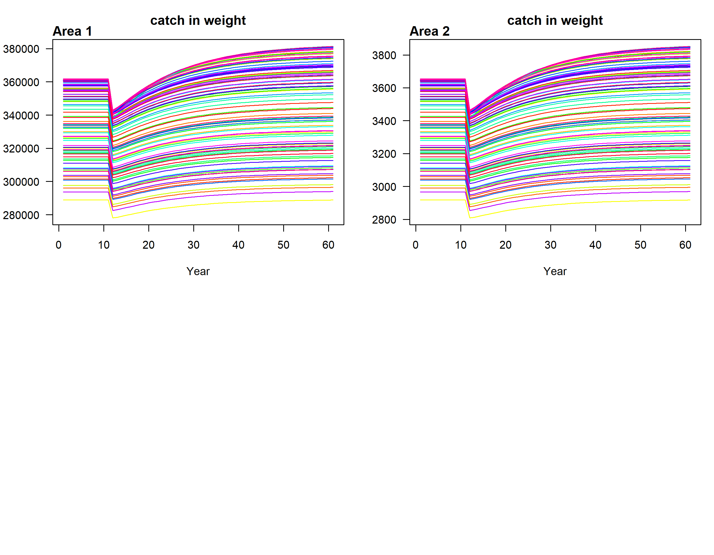
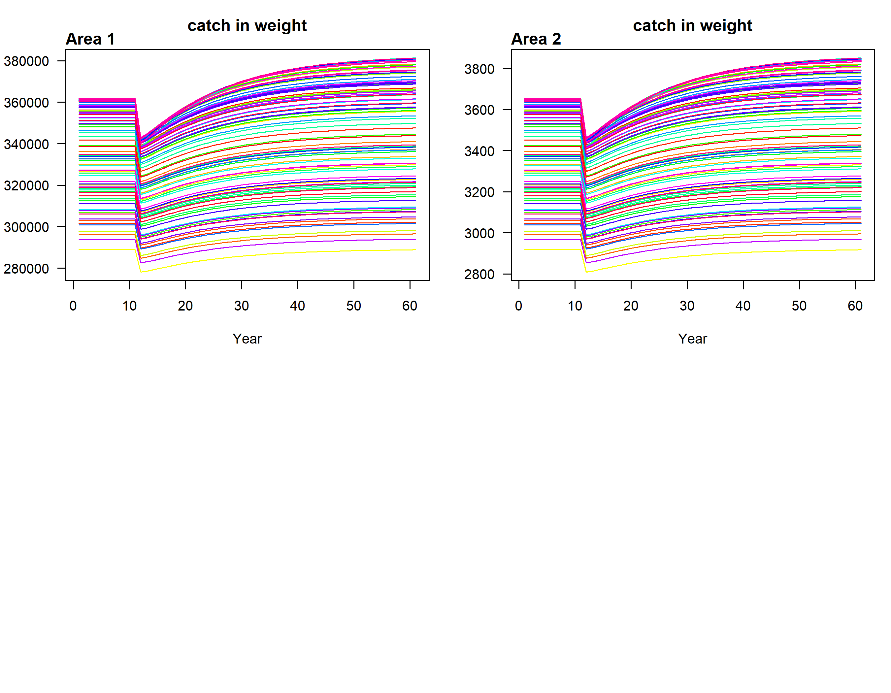

```{r, eval=TRUE, echo=TRUE}
StrategyObj<-new("Strategy")
StrategyObj@projectionYears <- 50
StrategyObj@projectionName<-"projectionStrategy"


StrategyObj@projectionParams<-list(bag = c(-99	-99	-99)), 

eff_vector=scan(text=("0	0	0	0	1.125	1.125	1.125	1.125	1.125	1.125	1.125	1.125	1.125	1.125	1.125	1.125	1.125	1.125	1.125	1.125	1.125	1.125	1.125	1.125	1.125	1.125	1.125	1.125	1.125	1.125	1.125	1.125	1.125	1.125	1.125	1.125	1.125	1.125	1.125	1.125	1.125	1.125	1.125	1.125	1.125	1.125	1.125	1.125	1.125	1.125	0	0	0	0	0	0	0	0	0	0	0	0	0	0	0	0	0	0	0	0	0	0	0	0	0	0	0	0	0	0	0	0	0	0	0	0	0	0	0	0	0	0	0	0	0	0	0	0	0	0	0	0	0	0	1.125	1.125	1.125	1.125	1.125	1.125	1.125	1.125	1.125	1.125	1.125	1.125	1.125	1.125	1.125	1.125	1.125	1.125	1.125	1.125	1.125	1.125	1.125	1.125	1.125	1.125	1.125	1.125	1.125	1.125	1.125	1.125	1.125	1.125	1.125	1.125	1.125	1.125	1.125	1.125	1.125	1.125	1.125	1.125	1.125	1.125	1	1	1	1	1	1	1	1	1	1	1	1	1	1	1	1	1	1	1	1	1	1	1	1	1	1	1	1	1	1	1	1	1	1	1	1	1	1	1	1	1	1	1	1	1	1	1	1	1	1"))


# ), effort = matrix(eff_vector, nrow=50, ncol=4, byrow = FALSE), CPUE = c(1,2), CPUEtype = 'retN') # CPUE is strategy excel proj_CPUE?
```

## Projection Modeling

In this section, we examine simple projection of a static management action (e.g., constant fishing effort).

In this example, `projectionParams` is a list with four items. The first item is a vector of length `areas` containing bag limits (`bag`). To indicate no bag limit, use `-99`. The bag limit should be considered as the take per unit time (e.g., per day) and basically acts like a CPUE threshold.
   
The second item is a matrix with `nrows = projectionYears` and `ncols = areas` that contains value multipliers of the initial equilibrium fishing effort (`effort`). This allows for the projection of effort reductions and the establishment of marine reserves by setting effort to `0`.

The two final items are a vector of length `areas` containing CPUE (`CPUE`), along with a `CPUEtype`, which is defined as a character string (e.g., `retN` for retention in numbers).

```{r, eval=TRUE, echo=TRUE}
StrategyObj@projectionYears <- 50
StrategyObj@projectionName<-"projectionStrategy"
StrategyObj@projectionParams<-list(bag = c(5, 5), effort = matrix(1:1, nrow=50, ncol=2, byrow = FALSE), CPUE = c(7,11), CPUEtype = 'retN')
```


# Examples {#examples}


## Fishery projections

```{r, eval=TRUE, echo=TRUE}
ProFisheryObj<-new("Fishery")
ProFisheryObj@title<-"Test"
ProFisheryObj@vulType<-"logistic"
ProFisheryObj@vulParams<-c(19, 0.9) # excel fishery-base row3 (is proj?)
ProFisheryObj@retType<-"logistic"
ProFisheryObj@retParams <- c(22, 0.1)#excel fishery-base row3 (is proj?)
ProFisheryObj@retMax <- 1
ProFisheryObj@Dmort <- 0
```

### The management strategy

Implementing a 25% effort reduction

```{r, eval=TRUE, echo=TRUE}
StrategyObj<-new("Strategy")
StrategyObj@projectionYears <- 50
StrategyObj@projectionName<-"projectionStrategy"
# I took effort from row 3 corresponding to strategy 25% red
eff_vector=scan(text=("0	0	0	0	1.125	1.125	1.125	1.125	1.125	1.125	1.125	1.125	1.125	1.125	1.125	1.125	1.125	1.125	1.125	1.125	1.125	1.125	1.125	1.125	1.125	1.125	1.125	1.125	1.125	1.125	1.125	1.125	1.125	1.125	1.125	1.125	1.125	1.125	1.125	1.125	1.125	1.125	1.125	1.125	1.125	1.125	1.125	1.125	1.125	1.125	0	0	0	0	0	0	0	0	0	0	0	0	0	0	0	0	0	0	0	0	0	0	0	0	0	0	0	0	0	0	0	0	0	0	0	0	0	0	0	0	0	0	0	0	0	0	0	0	0	0	0	0	0	0	1.125	1.125	1.125	1.125	1.125	1.125	1.125	1.125	1.125	1.125	1.125	1.125	1.125	1.125	1.125	1.125	1.125	1.125	1.125	1.125	1.125	1.125	1.125	1.125	1.125	1.125	1.125	1.125	1.125	1.125	1.125	1.125	1.125	1.125	1.125	1.125	1.125	1.125	1.125	1.125	1.125	1.125	1.125	1.125	1.125	1.125	1	1	1	1	1	1	1	1	1	1	1	1	1	1	1	1	1	1	1	1	1	1	1	1	1	1	1	1	1	1	1	1	1	1	1	1	1	1	1	1	1	1	1	1	1	1	1	1	1	1"))

# StrategyObj@projectionParams<-list(bag = c(-99	-99	-99	-99
# ), effort = matrix(eff_vector, nrow=50, ncol=4, byrow = FALSE), CPUE = c(1,2), CPUEtype = 'retN') # CPUE is strategy excel proj_CPUE?
```
### Projection modeling {#examples-projection}


## Running the projection and management strategy simulation

This section provides an example for the user on how to run projections using three management strategies that combine minimum size and bag limits.

```{r, eval=TRUE, echo=TRUE}
#Batch processing - 3 management strategies
stateLmin<-c(10.2, 12.7,  12.7)
stateBag<-c(20, -99, 20)
fileLabel<-c("Higher_option1", "Higher_option2", "Higher_option3")
projectionLabel<-c("Bag 20", "Min size 5 inch", "Bag 20 & min size 5 inch")
```

In this example, `stateLmin` is a vector containing three minimum sizes, and `stateBag` is a vector that contains three bag limits. To indicate no bag limit, use `-99`. `fileLabel` is a label for the file name, and `projectionLabel` defines the name for the strategy that will be evaluated.

To run the projection under the three different management strategies (i.e., "Bag 20", "Min size 5 inch", and "Bag 20 & Min size 5 inch"), we will use the `runProjection()`. 

In this example, we modify the retention parameters of the logistic function previously defined in `ProFisheryObj@retParams`. These parameters are now redefined as `ProFisheryObj@retParams <- c(stateLmin[sc], 0.1)`, using the pre-specified size limits (`stateLmin`).

Additionally, in the list structure of the `StrategyObj@projectionParams`, the elements of the `bag` vector are replaced by the specified bag limits (`stateBag`).

```{r, eval=FALSE, echo=TRUE}
for(sc in 1:NROW(stateLmin)){

  #Size limit - changes retention, not selectivity
  ProFisheryObj@retParams<-c(stateLmin[sc],0.1)

  #Bag limit
StrategyObj@projectionParams<-list(bag = c(stateBag[sc], stateBag[sc]), effort = matrix(1:1, nrow=50, ncol=2, byrow = FALSE), CPUE = c(7,11), CPUEtype = 'retN')

  runProjection(LifeHistoryObj = LifeHistoryObj,
                TimeAreaObj = TimeAreaObj,
                HistFisheryObj = HistFisheryObj,
                ProFisheryObj_list = list(ProFisheryObj, ProFisheryObj),
                StrategyObj = StrategyObj,
                StochasticObj = StochasticObj,
                wd = here("data-test", "Kole"),
                fileName = fileLabel[sc],
                doPlot = TRUE,
                titleStrategy = projectionLabel[sc]
  )
}
```

The `runProjection()` function contains several arguments. The objects `LifeHistoryObj`, `TimeAreaObj`, `HistFisheryObj`, `ProFisheryObj_list`, and `StrategyObj` were defined above. Among these, `LifeHistoryObj`, `TimeAreaObj`, and `HistFisheryObj` are required. The objects `StochasticObj`, `ProFisheryObj_list`, and `StrategyObj` are optional; however, `ProFisheryObj_list` should be used when `StrategyObj` is specified.

The function requires `ProFisheryObj` to be entered as a list, allowing the user to modify vulnerability, retention, and discard scenarios during the projection phase across different areas.

The `wd` argument is required and sets the working directory where the outputs of the projection will be saved. In this example, "Kole" is a subfolder of "data-test," so all plots will be stored in "Kole."

The `fileName` argument specifies the output file name and can be set to the `fileLabel` defined above. This argument is always required.

The `doPlot` argument is a logical value indicating whether to produce diagnostic plots upon completing simulations. The default is `FALSE` (no plots).

The `titleStrategy` argument describes the title for the management strategy being evaluated and can be set to the `projectionLabel`.

To explore all the arguments of this function, the user can use `?ProFisheryObj`.

Next, we present some of the plots produced by `runProjection()`.

```{r fig.cap="Spawning biomass by area- Higher_option1 ", echo=FALSE, out.width="100%"}

```

```{r fig-SB-H-opt2, fig.cap="Spawning biomass by area- Higher_option2 ", echo=FALSE, out.width="100%"}

```

```{r fig-SB-H-opt3, fig.cap="Spawning biomass by area- Higher_option3 ", echo=FALSE, out.width="100%"}

```

```{r fig-catch-H-opt1, fig.cap="Catch biomass by area- Higher_option1 ", echo=FALSE, out.width="100%"}

```

```{r fig-catch-H-opt2, fig.cap="Catch biomass by area- Higher_option2 ", echo=FALSE, out.width="100%"}

```


```{r fig-catch-H-opt3, fig.cap="Catch biomass by area- Higher_option3 ", echo=FALSE, out.width="100%"}

```
